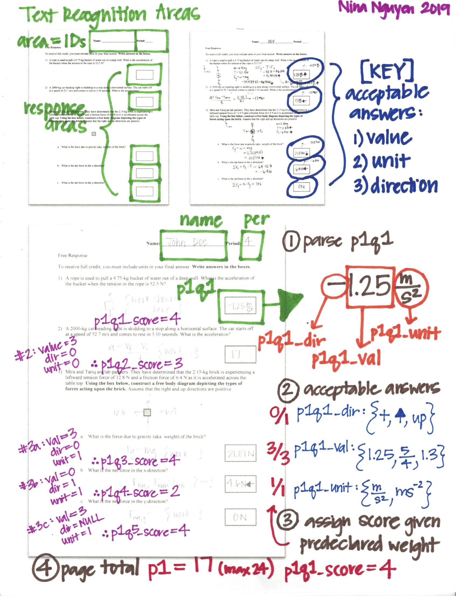

# autograder
#### An OCR-based autograder for handwritten free-response answers using TensorFlow and OpenCV.

### Motivation
Hand-grading free-response questions is a daunting task for many teachers. Current technology allows for autograding of multiple-choice questions (e.g., Illuminate has built-in scoring and gradebook update capabilities). However, OCR-based handwriting recognition is not yet readily available to the public. This tool aims to alleviate the grading burden for teachers.


## Table of contents

- [Overview](#overview)
- [Product Design](#product-design)
- [Data Sources](#data-sources)
- [Preprocessing](#image-processing)
- [Model & Evaluation](#model-and-evaluation)
    - [Baseline Models](#baseline-models)
        - [Decision Tree](#decision-tree-classifier)
        - [SVM](#SVM-classifier)
    - [Model Improvement](#CNN-classifier)
        - [CNN](#SVM-classifier)
- [Obtaining Data](#obtaining-data)
    - [MNIST](#MNIST)
    - [HASYv2](#HASYv2)
    - [Kensanata](#Kensanata)    
- [Build/Run App](#running-the-app)
- [App Prototype](#app-prototype)


# Overview


### Inspiration

Current technology is proprietary. I aim to create a lighter-weight, opensource tool with similar functionality. 

1. Illuminate Education software integrates OCR autograding and gradebook updating for multiple choice tests. As a former teacher, this tool was invaluable. It is the primary inspiration for my project.<br>
 <br>
2. Microsoft has powerful on-the-fly penstroke capturing software, Windows Ink, which parses handwritten digits and symbols into mathematical expressions.  <br>
 


# Product Design

#### This details the backend product design. View the current [web app prototype](#app-prototype).

| General | Detailed |
| --- | --- |
|  | |


# Data Sources
#### Detailed instructions for obtaining data is [provided here](#obtaining-data).<br>
| Name | Description | Usage | Resource | 
| --- | --- | --- | --- |
| [MNIST](#MNIST) | Well-known repository for handwritten digits | Training  | http://yann.lecun.com/exdb/mnist/ |
| [HASYv2](#HASYv2) | Over 150,000 handwritten characters (including LaTeX mathematical symbols) | Training | https://zenodo.org/record/259444 |
| [Kensanata](#Kensanata) | Over 16,000 labeled handwritten digits (includes gender, country, age) |  Testing | https://github.com/kensanata/numbers |
| CROHME | Competition on Recognition of Online Handwritten Mathematical Expressions (InkML format) | Future Directions | https://www.isical.ac.in/~crohme/CROHME_data.html | 


# Image Processing


| Stage | Image | Issues |
| --- | --- | --- | 
| Raw Image |  | From the human eye, 4 distinct segments are readily apparent. However, shadows and other subtle artifacts are detected by the computer as objects.  | 
| Preprocessed Binary |  | Results in 4000+ segments (expected 4) due to noisy, non-white background. Dots are each considered separate segments. Requires processing. | 
| Postprocessed Binary |  | Adjusting alpha levels and gaussian blurring reduces noise from raw image. Segmentation ready.  | 
| Segmented Image |  | Proper segmentation detects 4 objects.  | 


# Model and Evaluation
Model evaluation for all classifiers involves both MNIST test data (10K images) and a Kensanata subset (1500 images). The Kensanata dataset is important to classify, as it most closely resembles the data in my product usage. Unlike the uniformly sized and pre-cleaned images in the MNIST set, the Kensanata images are noisy and require a great deal preprocessing. This mimics the real-life conditions of images processed in the autograder app.

## Model Summary
Accuracy is summarized for each of the models. F1 scores is also used for model evaluation, as it combines recall and precision into one performance metric.

| Model | MNIST Test Set | Kensanata Test Set |
| --- | --- | --- |
| Decision Tree |  0.8759 | 0.3353 |
| SVM |  0.9375 | 0.3033 |
| CNN #1 | 0.9836 | 0.8040 |

The following F1 scores (and classification reports) are based on Kensanata data only.

| Model | F1 Score (Macro) | F1 Score by Digit| 
| --- | --- | --- | 
| Decision Tree | 0.33 | .png)  |
| SVM | 0.27 |  .png) | 
| CNN #1 | 0.80 | .png) |


# Baseline Models
Decision Tree and SVM classifiers were used as baseline models. 

### Decision Tree Classifier


| MNIST Test Set | Kensanata Test Set |
| --- | --- |
| .png "Decision Tree Classifier - MNIST" )  | .png "Decision Tree Classifier - Kensanata" ) |
| .png "Decision Tree Classifier - MNIST" )  | .png "Decision Tree Classifier - Kensanata" ) |


### SVM Classifier
Standard Scaler is used for SVM classsification. Although SVM works well with MNIST data, it does not perform well with Kenasata.

| MNIST Test Set | Kensanata Test Set |
| --- | --- |
| .png "SVM Classifier - MNIST" )  | .png "SVM Classifier - Kensanata" ) |
| .png "SVM Classifier - MNIST" )  | .png "SVM Classifier - Kensanata" ) |

# Model Improvement

### CNN Classifier
Improved on Kenasata dataset. Note: These images are processed raw, so that comparisons with MNIST is fair. This same model is used in the app, however after preprocessing of images. This results in even higher performance.

| MNIST Test Set | Kensanata Test Set |
| --- | --- |
| .png "CNN Classifier 1 - MNIST" )  | .png "CNN Classifier 1 - Kensanata" ) |
| .png "CNN Classifier 1 - MNIST" )  | .png "CNN Classifier 1 - Kensanata" ) |


# Obtaining Data
## MNIST
Data can be loaded using keras or sklearn.

#### keras has the full MNIST set
- 70,000 total images split into train (60K) and test (10K)
- image size: 28 x 28 pixels

```
from tensorflow.keras.datasets import mnist
(X_train,y_train),(X_test,y_test) = mnist.load_data()
```

#### sklearn has a small subset of MNIST
- 1,797 total images
- image size: 8 x 8 pixels

```
from sklearn.datasets import load_digits
digits = load_digits()
X = digits.data
y = digits.target
```

## HASYv2
HASYv2 is an extensive dataset, primarily consisting of LaTeX images. The following code limits the dataset to digits (line 34).

#### HASYv2 digit dataset
- 1,020 total images
- image size: 32 x 32 pixels

Running this code will return reshaped 28x28 image arrays 
```
from newDatasets import load_HASY
X,y = load_HASY() 
```

## Kensanata
Kensanata dataset includes interesting demographic data. There are ~17K digit images in the set. The [original file structure](https://github.com/kensanata/numbers?files=1) makes direct processing somewhat cumbersome. I have compiled the images into [a single directory](https://github.com/aprettyloner/autograder/tree/master/Kensanata). The naming schema has been retained to describe demographic information.
- country: (ISO 3166 Alpha-2 codes) or XX if unknown (e.g. Switzerland is CH)
- age: rounded to the nearest decade (e.g. 35 to 44 years is 4) or X if unknown
- sex: (M for man, F for woman, X for unknown, O for other)

#### Kensanata digit dataset
- 16,994 total images
- image size: varies

Running this code will return reshaped 28x28 image arrays 
```
from newDatasets import load_Kensanata
X,y = load_Kensanata() 
```

Running this code will return a dataframe with all information, including 28x28 image arrays  
```
from newDatasets import load_Kensanata
df = load_Kensanata(dataframe = True)
```

# Running the app
Clone repo via SSH or HTTPS
```
# using SSH
git clone git@github.com:aprettyloner/autograder.git

# using HTTPS
git clone https://github.com/aprettyloner/autograder.git
```

Install all dependencies
```
python3 -m pip install --user --upgrade pip
pip install -r requirements.txt
```

## Run the app
```
cd autograder/my_app/
export FLASK_APP=main.py
export FLASK_DEBUG=1
flask run
```

# App Prototype
Note: This is a very preliminary web app to work out backend functionality. The actual app design only requires users to designate crop areas and enter answer keys once. From there, any number of exams/assignments can be auto-graded by simply scanning the page.
<br>
The web app can be run on mobile phones. Using the upload interface, the user can take a photo directly.

| Webcam/IPEVO Example | Image/PDF Upload Example |
| --- | --- |
|  |  |

