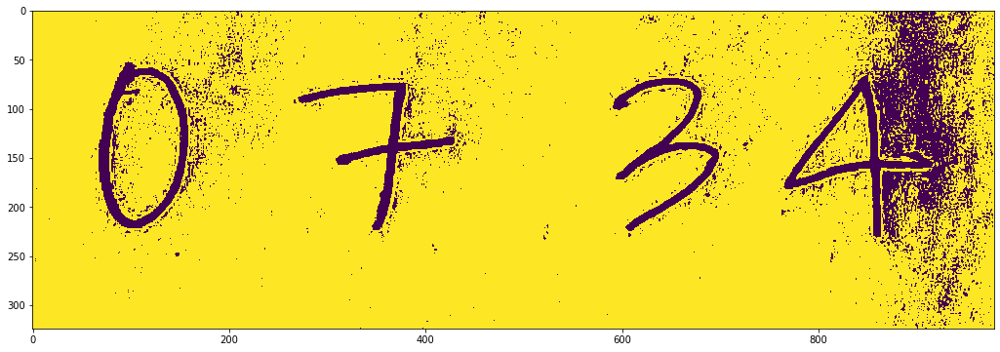
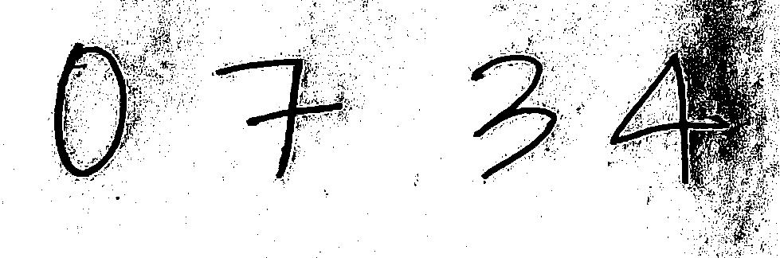
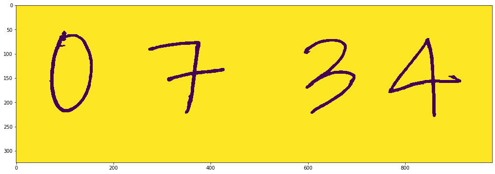

# autograder
Autograder for handwritten free-response answers using ML.

### Motivation

Hand-grading free-response questions is a daunting task for many teachers. Current technology allows for autograding of multiple-choice questions (e.g., Illuminate has built-in scoring and gradebook update capabilities). However, OCR-based handwriting recognition is not yet readily available to the public. This tool aims to alleviate the grading burden for teachers.

### Inspiration

Microsoft has very strong on-the-fly penstroke capturing software, Windows Ink. However, this technology is proprietary. I aim to create a lighter-weight, opensource tool with similar functionality. 

## Image Processing

#### Raw Image
Image taken from smartphone

     
#### Preprocessed Image
PIL image from raw image file

#### Binary Image
Preprocessed image converted to binary

     
     
#### Note: Segmentation fails. Results in 4000+ segments (expected 4) due to noisy, non-white background. Requires processing.

#### Preprocessed Image
PIL image from raw image file

     
     
#### Segmented Image
Proper segmentationg using skimage package

    
 