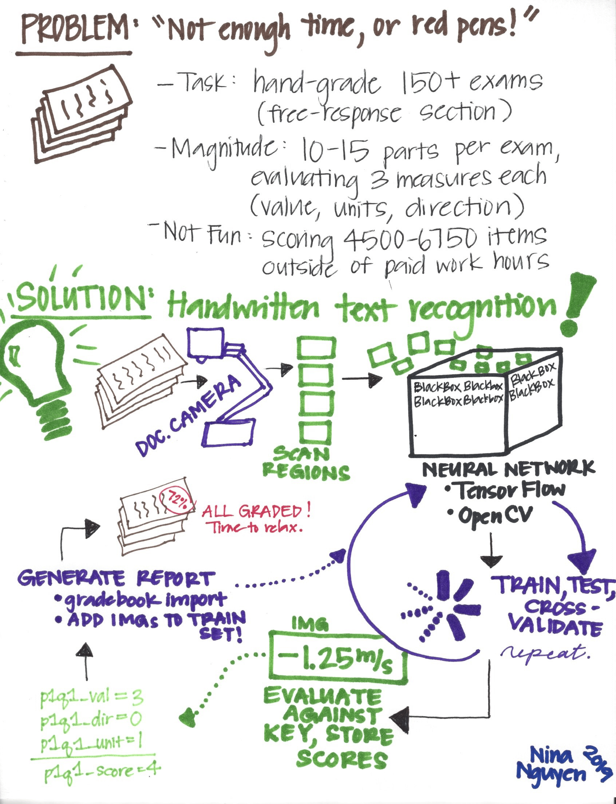

# autograder
Autograder for handwritten free-response answers using ML.\

### Motivation

Hand-grading free-response questions is a daunting task for many teachers. Current technology allows for autograding of multiple-choice questions (e.g., Illuminate has built-in scoring and gradebook update capabilities). However, OCR-based handwriting recognition is not yet readily available to the public. This tool aims to alleviate the grading burden for teachers.\

### Inspiration

Microsoft has very strong on-the-fly penstroke capturing software, Windows Ink. However, this technology is proprietary. I aim to create a lighter-weight, opensource tool with similar functionality. \

## Table of content

- [Preprocessing](#image-processing)
    - [TER](#typo3-extension-repository)
    - [Composer](#composer)
- [Product Design](#product-design)
    - [General](#general-design)
    - [Detailed](#detailed-design)
- [Page setup](#page-setup)
    - [Upload the page tree file](#upload-the-page-tree-file)
    - [Go to the import view](#go-to-the-import-view)
    - [Import the uploaded page tree file](#import-the-uploaded-page-tree-file)
- [License](#license)
- [Links](#links)

## Image Processing

### Raw Image
Image taken from smartphone\

     
### Preprocessing
PIL image from raw image file\

     
#### Issue: Segmentation fails. 
Results in 4000+ segments (expected 4) due to noisy, non-white background. 
 Dots are each considered separate segments. Requires processing.\

### Preprocessing
PIL image from raw image file\

     
     
### Segmented Image
Proper segmentation using skimage package\

    
 
## Product Design

<!-- 
 
  -->
